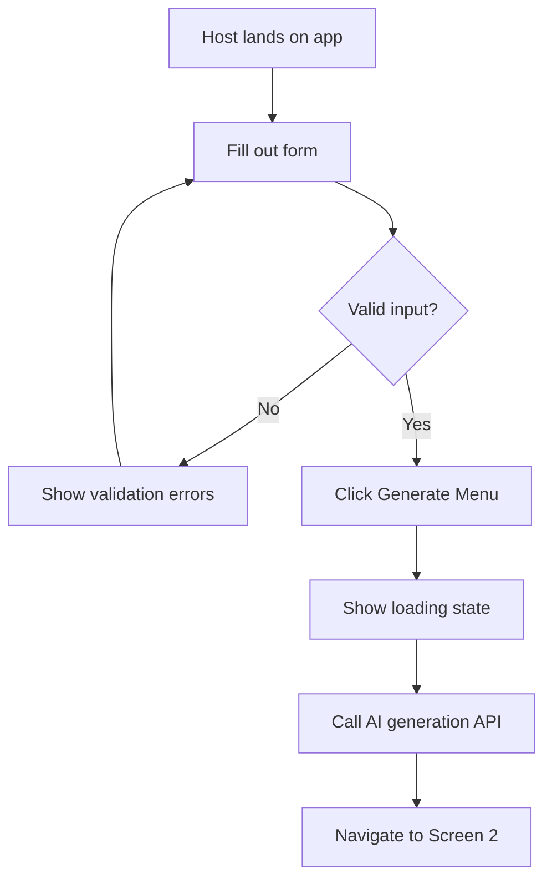
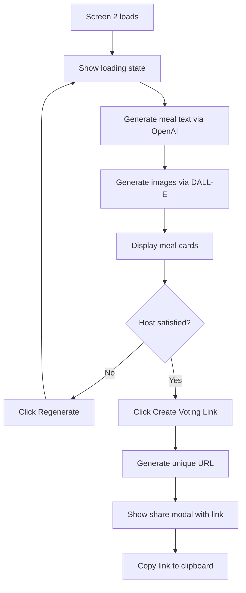
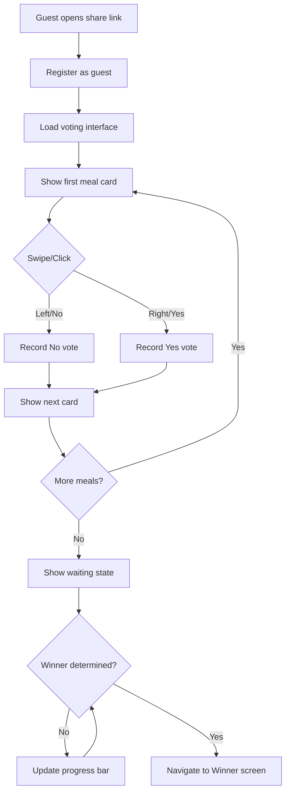
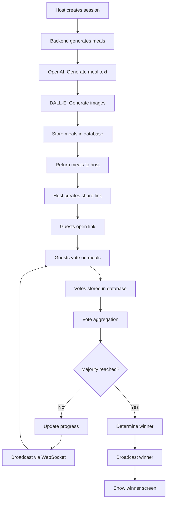

# Group Food Tinder - Project Plan

## Executive Summary

**App Name:** Group Food Tinder  
**Problem:** Group indecision when choosing meals  
**Solution:** Tinder-style voting on AI-generated meal options with real-time progress tracking  
**Voting Logic:** Majority "Yes" votes determines winner  
**Real-time Updates:** Progress indicators without exposing specific vote counts  
**AI Integration:** External APIs for text and image generation

---

## 1. Project Architecture & Data Models

### 1.1 Core Entities

```
Session
├── id (unique identifier)
├── vibe (string: event theme)
├── headcount (number)
├── dietary_restrictions (array: vegan, gluten-free, etc.)
├── status (enum: setup, generating, voting, completed)
├── share_link (unique URL)
├── created_at (timestamp)
└── expires_at (timestamp)

Meal
├── id (unique identifier)
├── session_id (foreign key)
├── title (string)
├── description (string)
├── image_url (string)
├── ingredients (array of objects)
│   ├── name (string)
│   ├── base_quantity (number)
│   └── unit (string)
└── created_at (timestamp)

Vote
├── id (unique identifier)
├── session_id (foreign key)
├── meal_id (foreign key)
├── guest_id (unique identifier per guest)
├── vote_type (enum: yes, no)
└── created_at (timestamp)

Guest
├── id (unique identifier)
├── session_id (foreign key)
├── has_voted (boolean)
└── joined_at (timestamp)
```

### 1.2 System Architecture

```
┌─────────────┐
│   Client    │ (React/Vue/Svelte - TBD)
│  (Browser)  │
└──────┬──────┘
       │ HTTP/WebSocket
       │
┌──────▼──────┐
│   Backend   │ (Node.js/Python/Go - TBD)
│   Server    │
└──────┬──────┘
       │
       ├──────────────┬──────────────┬──────────────┐
       │              │              │              │
┌──────▼──────┐ ┌────▼─────┐ ┌──────▼──────┐ ┌────▼─────┐
│  Database   │ │ OpenAI   │ │   DALL-E    │ │WebSocket │
│  (Postgres/ │ │   API    │ │     API     │ │  Server  │
│   MongoDB)  │ │          │ │             │ │          │
└─────────────┘ └──────────┘ └─────────────┘ └──────────┘
```

---

## 2. Screen Designs & User Flows

### 2.1 Screen 1: Setup (Host View)

**Purpose:** Collect event parameters and generate meal options

**UI Components:**
- Header with app branding
- Form container with:
  - Text input: "Event Vibe" (placeholder: "Fancy Taco Tuesday")
  - Number input: "Headcount" (min: 2, max: 20)
  - Toggle switches: Dietary restrictions
    - Vegan
    - Gluten-Free
    - (Extensible for more)
  - Primary CTA button: "Generate Menu"
- Loading state overlay during generation

**Validation Rules:**
- Vibe: Required, 3-100 characters
- Headcount: Required, 2-20 people
- Dietary restrictions: Optional

**User Flow:**


---

### 2.2 Screen 2: Menu Review (Host View)

**Purpose:** Display AI-generated meals and create shareable voting link

**UI Components:**
- Header with session info (vibe, headcount)
- Grid/carousel of 3-5 meal cards:
  - AI-generated image (16:9 or 1:1 ratio)
  - Catchy title
  - Short description (2-3 sentences)
  - Ingredient list (scaled to headcount)
    - Format: "2 lbs chicken breast, 4 cups rice"
- Primary CTA button: "Create Voting Link"
- Secondary button: "Regenerate Options"

**Loading State:**
- Skeleton cards with shimmer effect
- Progress text: "Generating delicious options..."
- Estimated time: "This may take 30-60 seconds"

**User Flow:**


---

### 2.3 Screen 3: Voting Interface (Guest View)

**Purpose:** Allow guests to vote on meals via swipe interface

**UI Components:**
- Header with session vibe
- Card stack interface:
  - Current meal card (large, centered)
    - Image
    - Title
    - Description
  - Swipe gestures:
    - Left = No (red overlay)
    - Right = Yes (green overlay)
  - Alternative: Explicit buttons for non-touch devices
- Progress indicator:
  - "X of Y meals reviewed"
  - Overall progress bar (without vote counts)
- Footer: "Waiting for others to finish..."

**Real-time Updates:**
- Progress bar updates as other guests vote
- No specific vote counts shown
- Notification when winner is determined

**User Flow:**


---

### 2.4 Winner Screen

**Purpose:** Display the winning meal with full recipe details

**UI Components:**
- Celebration animation/confetti
- Winner announcement: "Your group chose..."
- Large meal image
- Full recipe card:
  - Title
  - Description
  - Complete ingredient list (scaled to headcount)
  - Optional: Preparation steps
- Share buttons:
  - Copy recipe
  - Share to social media
- CTA: "Start New Session"

---

## 3. Backend Logic & API Design

### 3.1 Session Management APIs

**POST /api/sessions**
- Create new session
- Input: vibe, headcount, dietary_restrictions
- Output: session_id, status
- Triggers AI generation workflow

**GET /api/sessions/:id**
- Retrieve session details
- Output: session data, meals, current status

**POST /api/sessions/:id/regenerate**
- Regenerate meal options
- Triggers new AI generation

**POST /api/sessions/:id/share-link**
- Generate unique shareable URL
- Output: share_link (e.g., `/vote/:unique_token`)

---

### 3.2 AI Content Generation APIs

**Internal: generateMealOptions()**
- Called after session creation
- Steps:
  1. Construct prompt for OpenAI:
     - Include vibe, headcount, dietary restrictions
     - Request 3-5 distinct meal ideas
     - Format: JSON with title, description, ingredients
  2. Parse OpenAI response
  3. For each meal:
     - Generate image prompt
     - Call DALL-E API
     - Store image URL
  4. Scale ingredients based on headcount
  5. Save meals to database

**Prompt Engineering Strategy:**
```
System: You are a creative chef generating meal ideas.

User: Create 4 unique meal options for:
- Vibe: {vibe}
- Headcount: {headcount}
- Dietary restrictions: {restrictions}

Return JSON array with:
- title (catchy, 3-6 words)
- description (2-3 sentences, appetizing)
- ingredients (array with name, base_quantity for 1 person, unit)

Make each option distinct in cuisine and style.
```

**Image Generation Strategy:**
```
Prompt template: "Professional food photography of {meal_title}, 
{description}, appetizing presentation, natural lighting, 
high resolution, restaurant quality"
```

---

### 3.3 Voting & Real-time APIs

**POST /api/votes**
- Record guest vote
- Input: session_id, meal_id, guest_id, vote_type
- Output: success status
- Triggers vote aggregation check

**GET /api/sessions/:id/progress**
- Get voting progress (without specific counts)
- Output: 
  - total_guests
  - guests_completed
  - progress_percentage
  - winner_id (if determined)

**WebSocket: /ws/sessions/:id**
- Real-time updates for guests
- Events:
  - `progress_update`: New progress percentage
  - `winner_determined`: Winner meal_id
  - `guest_joined`: New guest count

---

### 3.4 Vote Aggregation Logic

**Algorithm: Determine Winner**
```
For each meal:
  yes_votes = count votes where vote_type = 'yes'
  total_votes = count all votes for this meal
  
  if total_votes == total_guests:
    vote_percentage = yes_votes / total_votes
    
    if vote_percentage >= 0.5:  // Majority threshold
      mark as potential winner

If multiple meals meet threshold:
  winner = meal with highest vote_percentage
  
If no meals meet threshold:
  winner = meal with highest yes_votes count
  (fallback to most popular)

Broadcast winner via WebSocket
```

---

## 4. Technical Implementation Details

### 4.1 Ingredient Scaling Algorithm

```javascript
function scaleIngredients(ingredients, baseHeadcount, targetHeadcount) {
  const scaleFactor = targetHeadcount / baseHeadcount;
  
  return ingredients.map(ingredient => ({
    name: ingredient.name,
    quantity: roundToNearestFraction(ingredient.base_quantity * scaleFactor),
    unit: ingredient.unit
  }));
}

function roundToNearestFraction(value) {
  // Round to nearest 1/4 for better recipe readability
  // e.g., 1.3 cups -> 1.25 cups
  return Math.round(value * 4) / 4;
}
```

---

### 4.2 Session Link Generation

```javascript
function generateShareLink(sessionId) {
  const token = crypto.randomBytes(16).toString('hex');
  
  // Store mapping: token -> session_id
  await db.sessionTokens.create({
    token: token,
    session_id: sessionId,
    expires_at: Date.now() + (24 * 60 * 60 * 1000) // 24 hours
  });
  
  return `${BASE_URL}/vote/${token}`;
}
```

---

### 4.3 Real-time Communication Architecture

**Technology Options:**
- WebSockets (Socket.io, ws library)
- Server-Sent Events (SSE)
- Long polling (fallback)

**Event Flow:**
```
Guest votes -> Backend receives vote -> Update database
-> Calculate new progress -> Broadcast to all connected guests
-> Check if winner determined -> If yes, broadcast winner event
```

**Connection Management:**
- Track active connections per session
- Handle disconnections gracefully
- Reconnection logic with state sync

---

### 4.4 Progress Indicator System

**Without Exposing Vote Counts:**
```javascript
function calculateProgress(sessionId) {
  const totalGuests = await db.guests.count({ session_id: sessionId });
  const guestsCompleted = await db.guests.count({ 
    session_id: sessionId, 
    has_voted: true 
  });
  
  return {
    progress_percentage: (guestsCompleted / totalGuests) * 100,
    guests_completed: guestsCompleted,
    total_guests: totalGuests,
    // Do NOT include individual meal vote counts
  };
}
```

**UI Display:**
- Progress bar: "3 of 5 friends have finished voting"
- No breakdown by meal
- No "X people liked this meal" indicators

---

## 5. Error Handling & Edge Cases

### 5.1 AI Generation Failures

**Scenarios:**
- API rate limits exceeded
- Invalid API responses
- Timeout errors

**Handling:**
- Retry logic with exponential backoff
- Fallback to cached/template meals
- Clear error messages to host
- Option to regenerate

---

### 5.2 Voting Edge Cases

**Scenario: Guest votes multiple times**
- Solution: Track guest_id, allow vote changes, use latest vote

**Scenario: Guest leaves before voting**
- Solution: Set timeout (e.g., 30 minutes), exclude inactive guests from total

**Scenario: Tie in votes**
- Solution: Use tiebreaker logic (first to reach threshold, random selection, or host decides)

**Scenario: All meals rejected**
- Solution: Winner = meal with most "yes" votes, even if below 50%

---

### 5.3 Session Expiration

- Sessions expire after 24 hours
- Cleanup job removes old sessions
- Expired link shows friendly error message
- Option to create new session

---

## 6. Security Considerations

### 6.1 Session Access Control

- Share links use cryptographically secure tokens
- No authentication required (frictionless UX)
- Rate limiting on session creation (prevent abuse)
- Token expiration after 24 hours

---

### 6.2 API Security

- API key management for OpenAI/DALL-E
- Environment variables for secrets
- Rate limiting on all endpoints
- Input validation and sanitization
- CORS configuration for frontend domain

---

### 6.3 Data Privacy

- No personal information collected
- Guest IDs are anonymous UUIDs
- Optional: GDPR-compliant data deletion
- Session data auto-deleted after expiration

---

## 7. Mobile Responsiveness

### 7.1 Design Principles

- Mobile-first approach
- Touch-optimized swipe gestures
- Responsive breakpoints:
  - Mobile: < 768px
  - Tablet: 768px - 1024px
  - Desktop: > 1024px

---

### 7.2 Screen Adaptations

**Screen 1 (Setup):**
- Single column form on mobile
- Larger touch targets (min 44x44px)
- Full-width inputs

**Screen 2 (Menu Review):**
- Vertical scroll on mobile
- Horizontal carousel on desktop
- Optimized image loading

**Screen 3 (Voting):**
- Full-screen card on mobile
- Swipe gestures primary interaction
- Button fallback for desktop

---

## 8. Implementation Roadmap

### Phase 1: Foundation (Week 1-2)
- [x] Project setup and architecture definition
- [ ] Database schema implementation
- [ ] Basic API structure
- [ ] Session creation endpoint
- [ ] Frontend routing setup

### Phase 2: Screen 1 & AI Integration (Week 3-4)
- [ ] Setup form UI implementation
- [ ] Form validation logic
- [ ] OpenAI API integration
- [ ] DALL-E API integration
- [ ] Meal generation workflow
- [ ] Ingredient scaling logic

### Phase 3: Screen 2 & Link Sharing (Week 5)
- [ ] Menu review UI implementation
- [ ] Loading states and animations
- [ ] Share link generation
- [ ] Copy-to-clipboard functionality
- [ ] Regenerate options feature

### Phase 4: Screen 3 & Voting (Week 6-7)
- [ ] Voting interface UI
- [ ] Swipe gesture implementation
- [ ] Vote recording API
- [ ] Guest registration logic
- [ ] Progress tracking system

### Phase 5: Real-time & Winner (Week 8)
- [ ] WebSocket server setup
- [ ] Real-time progress updates
- [ ] Vote aggregation logic
- [ ] Winner determination algorithm
- [ ] Winner screen UI
- [ ] Celebration animations

### Phase 6: Polish & Testing (Week 9-10)
- [ ] Mobile responsiveness testing
- [ ] Cross-browser compatibility
- [ ] Error handling improvements
- [ ] Performance optimization
- [ ] Security audit
- [ ] User acceptance testing

### Phase 7: Deployment (Week 11)
- [ ] Production environment setup
- [ ] CI/CD pipeline
- [ ] Monitoring and logging
- [ ] Documentation
- [ ] Launch

---

## 9. API Contract Documentation

### 9.1 Request/Response Examples

**POST /api/sessions**
```json
Request:
{
  "vibe": "Fancy Taco Tuesday",
  "headcount": 6,
  "dietary_restrictions": ["vegan"]
}

Response:
{
  "session_id": "abc123",
  "status": "generating",
  "created_at": "2026-04-30T09:00:00Z"
}
```

**GET /api/sessions/:id**
```json
Response:
{
  "session_id": "abc123",
  "vibe": "Fancy Taco Tuesday",
  "headcount": 6,
  "status": "voting",
  "meals": [
    {
      "meal_id": "meal1",
      "title": "Grilled Fish Tacos with Mango Salsa",
      "description": "Fresh grilled mahi-mahi topped with vibrant mango salsa...",
      "image_url": "https://...",
      "ingredients": [
        {"name": "mahi-mahi fillets", "quantity": 3, "unit": "lbs"},
        {"name": "mangoes", "quantity": 3, "unit": "whole"}
      ]
    }
  ],
  "share_link": "https://app.com/vote/xyz789"
}
```

**POST /api/votes**
```json
Request:
{
  "session_id": "abc123",
  "meal_id": "meal1",
  "guest_id": "guest456",
  "vote_type": "yes"
}

Response:
{
  "success": true,
  "vote_id": "vote789"
}
```

---

## 10. Data Flow Diagram



---

## 11. Success Metrics

### 11.1 Technical Metrics
- AI generation success rate > 95%
- Average generation time < 60 seconds
- Real-time update latency < 500ms
- Mobile responsiveness score > 90

### 11.2 User Experience Metrics
- Session completion rate > 80%
- Average time to winner < 5 minutes
- User satisfaction with meal options > 4/5
- Share link click-through rate > 70%

---

## Next Steps

1. **Review this plan** - Confirm all requirements are captured
2. **Choose tech stack** - Select specific frameworks and tools
3. **Set up development environment** - Initialize project structure
4. **Begin Phase 1 implementation** - Start with database and API foundation

---

## Appendix: Tech Stack Considerations (TBD)

### Frontend Options
- **React** - Large ecosystem, component reusability
- **Vue** - Simpler learning curve, good performance
- **Svelte** - Minimal bundle size, reactive by default

### Backend Options
- **Node.js + Express** - JavaScript full-stack, large ecosystem
- **Python + FastAPI** - Great for AI integration, async support
- **Go** - High performance, excellent concurrency

### Database Options
- **PostgreSQL** - Relational, ACID compliance, JSON support
- **MongoDB** - Document-based, flexible schema
- **Firebase** - Real-time built-in, managed service

### Real-time Options
- **Socket.io** - Easy WebSocket abstraction
- **Pusher** - Managed service, simple integration
- **Firebase Realtime Database** - Built-in real-time sync

### Hosting Options
- **Vercel/Netlify** - Frontend hosting, serverless functions
- **Heroku** - Full-stack hosting, easy deployment
- **AWS/GCP** - Scalable, full control, more complex