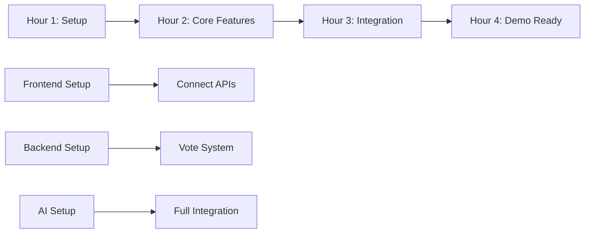

# Group Food Tinder - 4-Hour Hackathon Plan

## 🎯 Hackathon Goal
Build a working MVP of "Group Food Tinder" in 4 hours with 4 developers working in parallel.

## ⚡ Quick Tech Stack Decision (5 min - All together)
- **Frontend:** React + Vite (fast setup)
- **Backend:** Node.js + Express
- **Database:** Firebase Realtime Database (no setup needed)
- **AI:** OpenAI API (text) + Placeholder images initially
- **Real-time:** Firebase Realtime Database (built-in)
- **Hosting:** Vercel (frontend) + Render/Railway (backend)

---

## 👥 Team Roles

### 🎨 Developer 1: Frontend - Host Flow
**Screens:** Setup (Screen 1) + Menu Review (Screen 2)

### 🎨 Developer 2: Frontend - Guest Flow  
**Screens:** Voting (Screen 3) + Winner (Screen 4)

### ⚙️ Developer 3: Backend - Core APIs
**Focus:** Session management + Database setup

### 🤖 Developer 4: Backend - AI & Logic
**Focus:** AI integration + Vote aggregation

---

## ⏱️ Hour-by-Hour Breakdown

### Hour 1: Setup & Foundation (0:00 - 1:00)

#### Developer 1: Frontend Setup + Screen 1 Structure
**Time: 60 min**
- [ ] 0-10 min: Create React + Vite project, install dependencies
- [ ] 10-20 min: Set up routing (React Router)
- [ ] 20-40 min: Build Screen 1 form (vibe, headcount, dietary toggles)
- [ ] 40-50 min: Add basic styling (Tailwind or CSS)
- [ ] 50-60 min: Create mock API call structure

**Deliverable:** Working form that captures user input

---

#### Developer 2: Frontend Setup + Screen 3 Structure
**Time: 60 min**
- [ ] 0-10 min: Clone Dev 1's repo, set up local environment
- [ ] 10-25 min: Install swipe library (react-tinder-card or similar)
- [ ] 25-45 min: Build card stack component with swipe gestures
- [ ] 45-55 min: Add basic styling for cards
- [ ] 55-60 min: Create mock vote handler

**Deliverable:** Swipeable card interface (with mock data)

---

#### Developer 3: Backend Setup + Database
**Time: 60 min**
- [ ] 0-15 min: Create Node.js + Express project
- [ ] 15-25 min: Set up Firebase project and credentials
- [ ] 25-40 min: Create database schema in Firebase
  ```
  sessions/{sessionId}
    - vibe, headcount, dietary_restrictions
    - meals: [{id, title, description, image, ingredients}]
    - votes: {guestId: {mealId: "yes/no"}}
    - status: "setup/voting/completed"
  ```
- [ ] 40-50 min: Build POST /api/sessions endpoint
- [ ] 50-60 min: Build GET /api/sessions/:id endpoint

**Deliverable:** Working session creation and retrieval API

---

#### Developer 4: AI Integration Setup
**Time: 60 min**
- [ ] 0-10 min: Set up OpenAI API credentials
- [ ] 10-30 min: Create meal generation prompt template
- [ ] 30-50 min: Build generateMeals() function
  - Call OpenAI API
  - Parse response into meal objects
  - Use placeholder images (Unsplash API or static URLs)
- [ ] 50-60 min: Test with sample inputs

**Deliverable:** Working AI meal generation function

---

### Hour 2: Core Features (1:00 - 2:00)

#### Developer 1: Connect Screen 1 & Build Screen 2
**Time: 60 min**
- [ ] 0-15 min: Connect form to backend API
- [ ] 15-25 min: Add loading state during generation
- [ ] 25-45 min: Build Screen 2 meal cards display
- [ ] 45-55 min: Add "Create Voting Link" button
- [ ] 55-60 min: Generate and display shareable link

**Deliverable:** Complete host flow (create session → see meals → get link)

---

#### Developer 2: Connect Screen 3 & Build Screen 4
**Time: 60 min**
- [ ] 0-15 min: Connect to Firebase to load meals
- [ ] 15-30 min: Implement vote recording on swipe
- [ ] 30-45 min: Build Screen 4 (Winner display)
- [ ] 45-55 min: Add navigation from voting to winner
- [ ] 55-60 min: Style winner screen with celebration

**Deliverable:** Complete guest flow (vote → see winner)

---

#### Developer 3: Vote Management + Real-time
**Time: 60 min**
- [ ] 0-20 min: Build POST /api/votes endpoint
- [ ] 20-35 min: Implement vote aggregation logic
- [ ] 35-50 min: Build winner determination algorithm
- [ ] 50-60 min: Set up Firebase listeners for real-time updates

**Deliverable:** Working vote system with real-time updates

---

#### Developer 4: AI Integration + Ingredient Scaling
**Time: 60 min**
- [ ] 0-20 min: Integrate AI generation into session creation flow
- [ ] 20-35 min: Build ingredient scaling algorithm
- [ ] 35-50 min: Add error handling for AI failures
- [ ] 50-60 min: Optimize AI prompts for better results

**Deliverable:** Fully integrated AI meal generation

---

### Hour 3: Integration & Polish (2:00 - 3:00)

#### Developer 1: Polish Host Experience
**Time: 60 min**
- [ ] 0-20 min: Fix any integration bugs
- [ ] 20-35 min: Improve loading states and animations
- [ ] 35-50 min: Add error handling and validation
- [ ] 50-60 min: Mobile responsiveness for Screen 1 & 2

**Deliverable:** Polished host experience

---

#### Developer 2: Polish Guest Experience
**Time: 60 min**
- [ ] 0-20 min: Fix any integration bugs
- [ ] 20-35 min: Add progress indicator
- [ ] 35-50 min: Improve swipe animations
- [ ] 50-60 min: Mobile responsiveness for Screen 3 & 4

**Deliverable:** Polished guest experience

---

#### Developer 3: Testing & Deployment Prep
**Time: 60 min**
- [ ] 0-20 min: End-to-end testing of all APIs
- [ ] 20-35 min: Fix critical bugs
- [ ] 35-50 min: Set up backend deployment (Render/Railway)
- [ ] 50-60 min: Deploy backend and test

**Deliverable:** Deployed and tested backend

---

#### Developer 4: Testing & Optimization
**Time: 60 min**
- [ ] 0-20 min: Test AI generation with various inputs
- [ ] 20-35 min: Test vote aggregation edge cases
- [ ] 35-50 min: Optimize AI prompts for speed
- [ ] 50-60 min: Help with deployment issues

**Deliverable:** Tested and optimized AI system

---

### Hour 4: Final Integration & Demo Prep (3:00 - 4:00)

#### All Developers (Collaborative)
**Time: 60 min**
- [ ] 0-15 min: Deploy frontend to Vercel
- [ ] 15-30 min: Full end-to-end testing
- [ ] 30-40 min: Fix critical bugs
- [ ] 40-50 min: Prepare demo script
- [ ] 50-55 min: Test demo flow
- [ ] 55-60 min: Final polish and screenshots

**Deliverable:** Working demo ready to present

---

## 🚀 Quick Start Commands

### Developer 1 & 2 (Frontend)
```bash
# Create React app
npm create vite@latest food-tinder-frontend -- --template react
cd food-tinder-frontend
npm install
npm install react-router-dom axios firebase
npm install -D tailwindcss postcss autoprefixer
npx tailwindcss init -p

# For Dev 2: Add swipe library
npm install react-tinder-card
```

### Developer 3 & 4 (Backend)
```bash
# Create Express app
mkdir food-tinder-backend
cd food-tinder-backend
npm init -y
npm install express cors dotenv firebase-admin openai
npm install -D nodemon

# Create basic structure
mkdir src
touch src/index.js src/routes.js src/firebase.js src/ai.js
```

---

## 📋 MVP Feature Checklist

### Must Have (Core Demo)
- [x] Screen 1: Form to input vibe and headcount
- [x] AI generates 3-4 meal options with descriptions
- [x] Screen 2: Display meals with placeholder images
- [x] Generate shareable link
- [x] Screen 3: Swipe interface for voting
- [x] Record votes in real-time
- [x] Screen 4: Display winner when majority reached

### Nice to Have (If Time Permits)
- [ ] Dietary restriction filtering
- [ ] Actual AI-generated images (DALL-E)
- [ ] Progress indicator during voting
- [ ] Celebration animation on winner screen
- [ ] Ingredient scaling display
- [ ] Mobile-optimized gestures

### Skip for Hackathon
- ❌ Session expiration
- ❌ Advanced error handling
- ❌ User authentication
- ❌ Analytics
- ❌ Social sharing
- ❌ Recipe preparation steps

---

## 🔥 Critical Path (Must Complete)



**Blocking Dependencies:**
1. Dev 3 must finish session API before Dev 1 can integrate (Hour 1)
2. Dev 4 must finish AI before Dev 3 can integrate (Hour 1)
3. Dev 3 must finish vote API before Dev 2 can integrate (Hour 2)

---

## 💡 Hackathon Tips

### Communication
- **Quick sync every hour** (5 min max)
- Use Slack/Discord for instant questions
- Share API endpoints in shared doc immediately

### Code Quality
- **Don't over-engineer** - working > perfect
- **Copy-paste is OK** - speed matters
- **Skip tests** - manual testing only
- **Hardcode when needed** - no shame in hackathons

### Time Management
- **Set 10-min alarms** - stay on track
- **Cut features ruthlessly** - MVP only
- **Ask for help immediately** - don't waste 20 min stuck

### Demo Prep
- **Test the happy path** - make sure basic flow works
- **Have backup plan** - screenshots if live demo fails
- **Practice 2-min pitch** - clear problem → solution → demo

---

## 🎬 Demo Script (2 minutes)

**0:00-0:30 - Problem**
"Ever tried to decide where to eat with friends? It's impossible! We built Group Food Tinder to solve this."

**0:30-1:00 - Solution**
"A host enters a vibe like 'Fancy Taco Tuesday' and headcount. AI generates meal options. Everyone swipes yes or no. First meal to get majority wins!"

**1:00-1:45 - Live Demo**
1. Show Screen 1 - create session
2. Show Screen 2 - AI-generated meals
3. Share link (open in new tab)
4. Show Screen 3 - swipe through meals
5. Show Screen 4 - winner revealed

**1:45-2:00 - Wrap Up**
"Built in 4 hours with React, Node.js, Firebase, and OpenAI. No more group indecision!"

---

## 🆘 Emergency Fallbacks

### If AI is too slow:
- Use pre-generated meals from a JSON file
- Show "AI generation" but load from cache

### If real-time breaks:
- Use polling (check for winner every 2 seconds)
- Manual refresh button

### If deployment fails:
- Run locally and screen share
- Use ngrok for quick public URL

### If swipe library breaks:
- Use simple buttons (Yes/No)
- Still works, just less fancy

---

## 📊 Success Metrics

### Minimum Viable Demo:
- ✅ Can create a session
- ✅ Can see generated meals
- ✅ Can vote on meals
- ✅ Can see a winner

### Bonus Points:
- ✅ Looks good on mobile
- ✅ Real-time updates work
- ✅ AI generates creative meals
- ✅ Smooth animations

---

## 🎯 Final Checklist (Last 10 minutes)

- [ ] Frontend deployed and accessible
- [ ] Backend deployed and responding
- [ ] Can create session from any device
- [ ] Can vote from multiple devices
- [ ] Winner displays correctly
- [ ] Demo script practiced
- [ ] Screenshots taken as backup
- [ ] Team ready to present

---

## 🏆 Judging Criteria Focus

1. **Functionality (40%)** - Does it work end-to-end?
2. **Innovation (30%)** - Creative use of AI, fun concept
3. **Design (20%)** - Clean UI, smooth interactions
4. **Presentation (10%)** - Clear demo, good storytelling

**Strategy:** Prioritize functionality first, then make it look good!

---

## Quick Reference: Who Owns What

| Component | Owner | Helper |
|-----------|-------|--------|
| Screen 1 | Dev 1 | - |
| Screen 2 | Dev 1 | - |
| Screen 3 | Dev 2 | - |
| Screen 4 | Dev 2 | - |
| Session API | Dev 3 | - |
| Vote API | Dev 3 | Dev 4 |
| AI Generation | Dev 4 | - |
| Firebase Setup | Dev 3 | Dev 4 |
| Deployment | Dev 3 | All |

---

## 🚨 Red Flags to Watch

**Hour 1:**
- If setup takes > 20 min → Use create-react-app or Vite templates
- If Firebase confusing → Switch to simple JSON file storage

**Hour 2:**
- If AI too slow → Use mock data, add AI later
- If real-time complex → Use simple polling

**Hour 3:**
- If bugs everywhere → Focus on one happy path
- If styling takes too long → Use component library (MUI/Chakra)

**Hour 4:**
- If deployment failing → Run locally with ngrok
- If features incomplete → Cut scope, demo what works

---

**Remember: A working simple demo beats a broken complex one!** 🎉