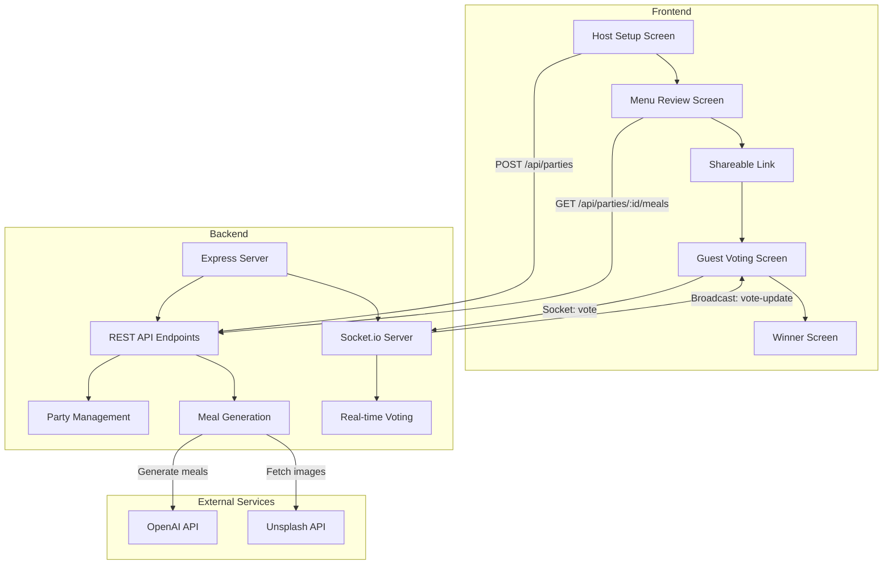

# Meal Voting App - Technical Specification

## Project Overview
A local-development meal voting application where a host creates a party with a vibe/theme, generates meal options, and shares a link with guests who vote Tinder-style until a unanimous winner is found.

## Technology Stack

### Frontend
- **Framework**: React 18+
- **Routing**: React Router v6
- **Real-time**: Socket.io Client
- **Styling**: CSS Modules or Tailwind CSS
- **HTTP Client**: Fetch API or Axios

### Backend
- **Runtime**: Node.js
- **Framework**: Express.js
- **Real-time**: Socket.io Server
- **Storage**: In-memory (Map/Object for local dev)
- **AI Integration**: OpenAI GPT API (optional for meal generation)
- **Image Source**: Unsplash API (free tier)

## Architecture Overview



## Data Models

### Party
```javascript
{
  id: string,              // UUID
  vibe: string,            // e.g., "Fancy Taco Tuesday"
  headcount: number,       // Number of guests
  dietaryRestrictions: {
    vegan: boolean,
    glutenFree: boolean
  },
  meals: Meal[],
  createdAt: timestamp,
  status: 'setup' | 'voting' | 'completed'
}
```

### Meal
```javascript
{
  id: string,
  title: string,
  description: string,
  imageUrl: string,
  ingredients: string[],   // Scaled to headcount
  votes: {
    [guestId]: 'yes' | 'no' | null
  }
}
```

### Guest
```javascript
{
  id: string,              // UUID
  partyId: string,
  joinedAt: timestamp
}
```

## API Endpoints

### REST API

#### Create Party
- **POST** `/api/parties`
- **Body**: `{ vibe, headcount, dietaryRestrictions }`
- **Response**: `{ partyId, meals[] }`

#### Get Party Details
- **GET** `/api/parties/:id`
- **Response**: `{ party, meals[], votingStatus }`

#### Generate Meals
- **POST** `/api/parties/:id/generate-meals`
- **Response**: `{ meals[] }`

### Socket.io Events

#### Client → Server
- `join-party`: Join a voting session
- `vote`: Submit a vote for a meal
- `disconnect`: Leave the party

#### Server → Client
- `party-update`: Broadcast party state changes
- `vote-update`: Broadcast vote changes
- `winner-found`: Announce unanimous winner
- `guest-joined`: Notify when new guest joins

## Screen Specifications

### Screen 1: Host Setup
**Components:**
- `HostSetup.jsx`
- `VibeInput.jsx`
- `HeadcountInput.jsx`
- `DietaryToggle.jsx`

**Features:**
- Text input for vibe/theme
- Number input for headcount (min: 2, max: 20)
- Toggle switches for dietary restrictions
- Form validation
- Submit button triggers meal generation

### Screen 2: Menu Review
**Components:**
- `MenuReview.jsx`
- `MealCard.jsx`
- `LoadingSpinner.jsx`

**Features:**
- Loading state during meal generation
- Display 3-5 meal cards with:
  - Image from Unsplash
  - Title
  - Description
  - Ingredient list (scaled)
- "Create Voting Link" button
- Copy-to-clipboard functionality

### Screen 3: Guest Voting
**Components:**
- `GuestVoting.jsx`
- `SwipeableCard.jsx`
- `VotingProgress.jsx`

**Features:**
- Card stack interface
- Swipe gestures (left = no, right = yes)
- Alternative: Yes/No buttons for desktop
- Real-time vote synchronization
- Progress indicator showing votes received
- Auto-advance to winner screen

### Winner Screen
**Components:**
- `WinnerScreen.jsx`
- `RecipeDetails.jsx`

**Features:**
- Celebration animation
- Display winning meal details
- Full ingredient list
- Optional: cooking instructions
- Share/export functionality

## Real-time Voting Logic

### Vote Tracking
```javascript
// Each meal tracks votes from all guests
meal.votes = {
  'guest-1': 'yes',
  'guest-2': 'yes',
  'guest-3': null  // hasn't voted yet
}
```

### Winner Detection Algorithm
```javascript
function checkForWinner(party) {
  const totalGuests = party.guestCount;
  
  for (const meal of party.meals) {
    const votes = Object.values(meal.votes);
    const yesVotes = votes.filter(v => v === 'yes').length;
    
    // Unanimous winner
    if (yesVotes === totalGuests) {
      return meal;
    }
  }
  
  return null;
}
```

## Image Integration Strategy

### Unsplash API Integration
- Use Unsplash API for fetching food images
- Search query: meal title + "food"
- Fallback: Generic food placeholder images
- Cache images in memory for session

### Alternative: Local Placeholder
- Use placeholder.com or similar service
- Pattern: `https://via.placeholder.com/400x300?text=Meal+Name`

## Development Setup

### Project Structure
```
meal-voting-app/
├── backend/
│   ├── server.js
│   ├── routes/
│   │   └── parties.js
│   ├── services/
│   │   ├── mealGenerator.js
│   │   └── imageService.js
│   ├── socket/
│   │   └── votingHandler.js
│   └── package.json
├── frontend/
│   ├── src/
│   │   ├── components/
│   │   │   ├── HostSetup.jsx
│   │   │   ├── MenuReview.jsx
│   │   │   ├── GuestVoting.jsx
│   │   │   └── WinnerScreen.jsx
│   │   ├── services/
│   │   │   ├── api.js
│   │   │   └── socket.js
│   │   ├── App.jsx
│   │   └── main.jsx
│   └── package.json
└── README.md
```

### Environment Variables
```env
# Backend (.env)
PORT=3001
OPENAI_API_KEY=sk-... (optional)
UNSPLASH_ACCESS_KEY=... (optional)
NODE_ENV=development

# Frontend (.env)
VITE_API_URL=http://localhost:3001
```

### Running Locally
```bash
# Terminal 1 - Backend
cd backend
npm install
npm run dev

# Terminal 2 - Frontend
cd frontend
npm install
npm run dev
```

## Testing Strategy

### Manual Testing Checklist
- [ ] Host can create party with vibe and headcount
- [ ] Meals generate with images and descriptions
- [ ] Shareable link works in new browser tab
- [ ] Multiple guests can join same party
- [ ] Votes sync in real-time across all clients
- [ ] Winner detected when all guests vote yes
- [ ] Winner screen displays correct meal details
- [ ] Error handling for network issues
- [ ] Mobile responsive design works

## Future Enhancements (Out of Scope)
- Persistent database (PostgreSQL/MongoDB)
- User authentication
- Party history
- Recipe ratings
- Shopping list generation
- Calendar integration
- Push notifications
- Progressive Web App (PWA)

## Security Considerations (Local Dev)
- CORS enabled for localhost only
- No authentication required for local dev
- Rate limiting on API endpoints
- Input validation and sanitization
- XSS prevention in user inputs

## Performance Optimization
- Lazy load images
- Debounce API calls
- Socket.io connection pooling
- In-memory caching for party data
- Optimize bundle size with code splitting

---

**Last Updated**: 2026-04-30
**Status**: Planning Phase