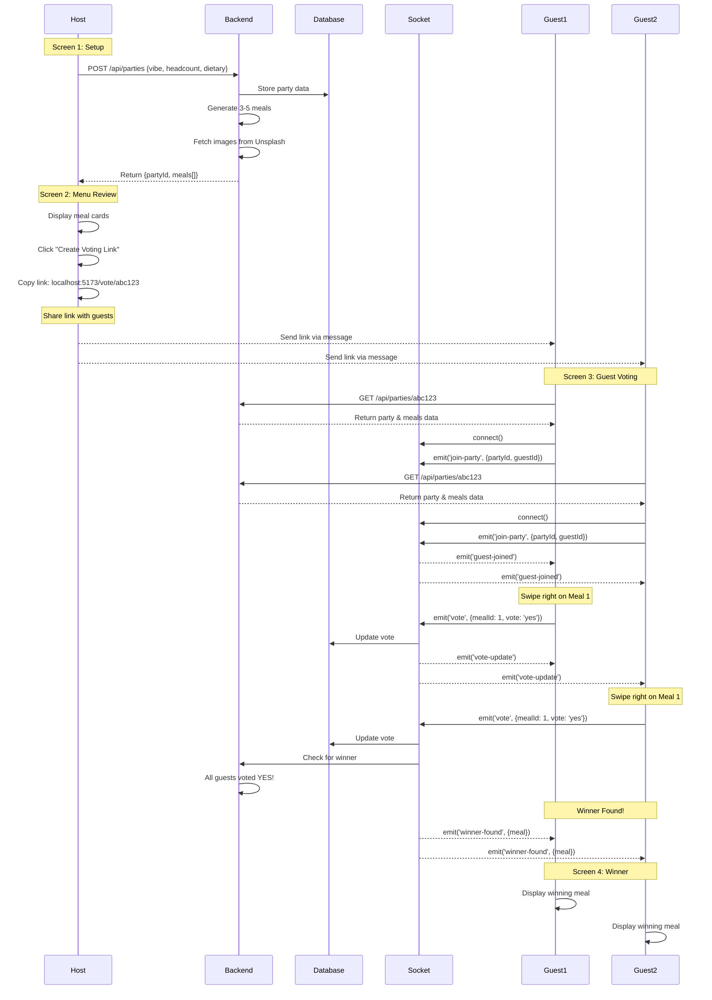
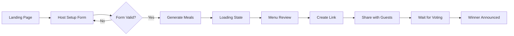
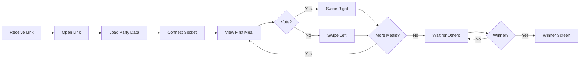
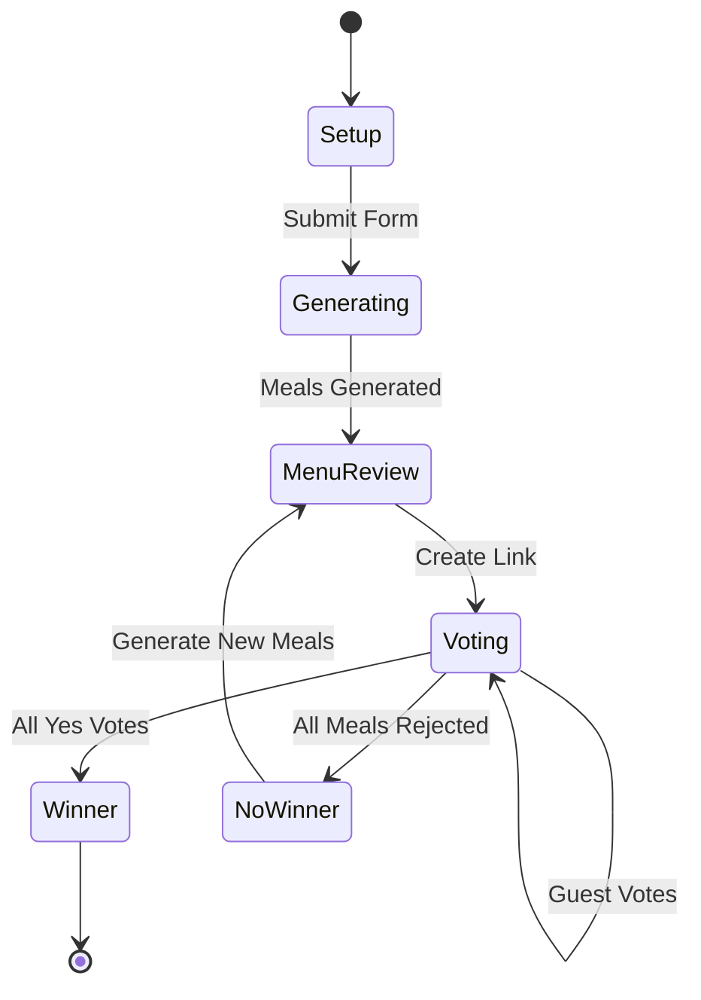
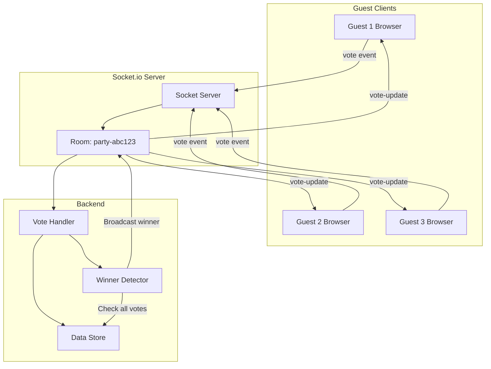
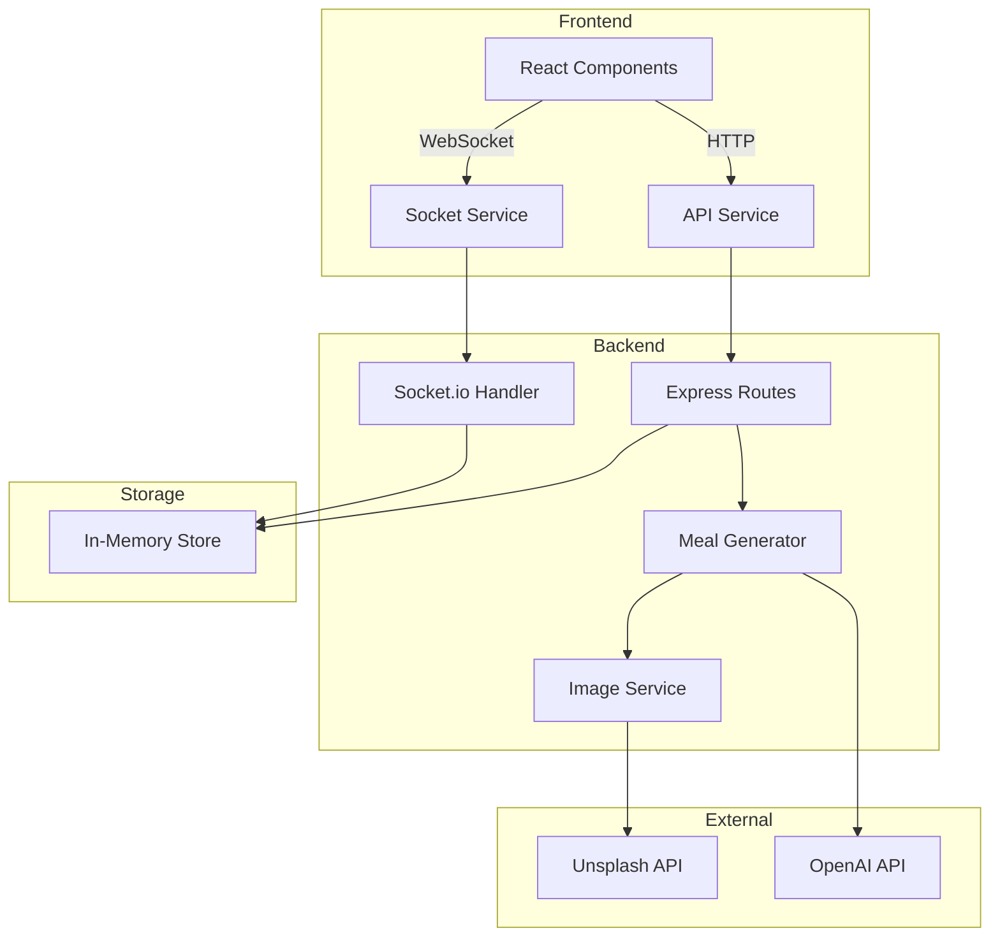
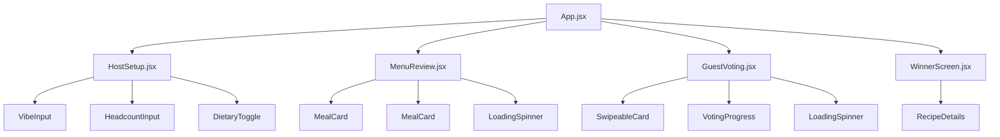
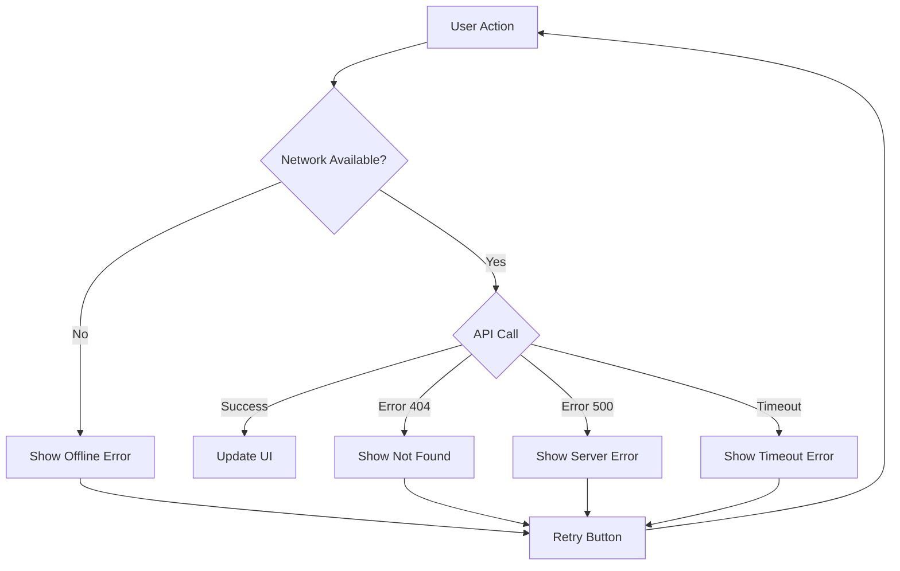
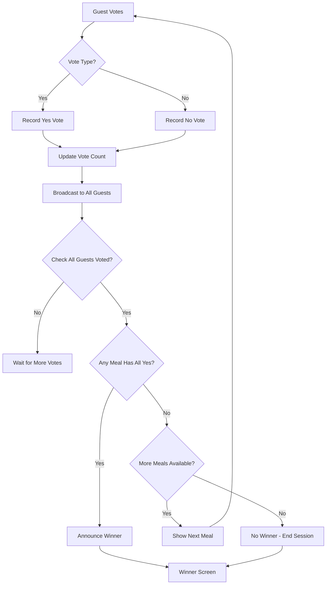

# Meal Voting App - User Flow Diagram

## Complete User Journey

## Detailed Screen Flow

### Host Journey

### Guest Journey

## State Management Flow

## Real-time Voting Synchronization

## Data Flow Architecture

## Component Hierarchy

## Error Handling Flow

## Voting Logic Flowchart

---

This visual documentation provides a complete overview of how the application flows from user interactions to backend processing and real-time synchronization.